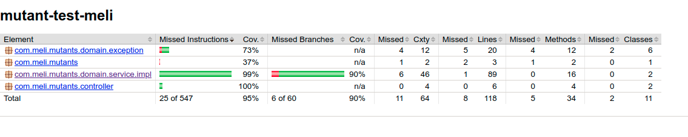

# Mutant Test MeLi

_Examen Mercadolibre Magneto quiere reclutar la mayor cantidad de mutantes para poder luchar contra los X-Men. Te ha contratado a ti para que desarrolles un proyecto que detecte si un humano es mutante basándose en su secuencia de ADN.

Para eso te ha pedido crear un programa con un método o función con la siguiente firma (En alguno de los siguiente lenguajes: Java / Golang / C-C++ / Javascript (node) / Python / Ruby):

boolean isMutant(String[] dna); // Ejemplo Java

En donde recibirás como parámetro un array de Strings que representan cada fila de una tabla de (NxN) con la secuencia del ADN. Las letras de los Strings solo pueden ser: (A,T,C,G), las cuales representa cada base nitrogenada del ADN.

Sabrás si un humano es mutante, si encuentras ​más de una secuencia de cuatro letras iguales​, de forma oblicua, horizontal o vertical. Ejemplo (Caso mutante): String[] dna = {"ATGCGA","CAGTGC","TTATGT","AGAAGG","CCCCTA","TCACTG"};

En este caso el llamado a la función isMutant(dna) devuelve “true”. Desarrolla el algoritmo de la manera más eficiente posible_

## Backend

### Pre-requisitos 📋

_1. Se debe tener una base de datos instalada localmente en Mongo (Si se desea probar local) con una colección llamada **dna_mutants**_

_2. Se debe contar  con la versión de 11 o superior para ejecutar el proyecto_

_3. Se debe contar con la instalación de Gradle 4.10.0 o superior._

### Instalación 🔧
_Se deben descargar las dependencias del proyecto inicialmente con:_

```
./gradlew clean build
```

## Ejecución de pruebas unitarias ⚙️
_El proyecto cuenta con sus respectivas pruebas unitarias las cuales se puede ejecutar con:_

```
./gradlew test
```

_Una vez ejecutadas, el proyecto cuenta con un plugin llamado **Jacoco** con el cual se puede ver el porcentaje de cobertura de pruebas. Estas quedan almacenadas en la ruta:_
```
build/reports/jacoco/test/html/index.html
```

## Ejecución de pruebas unitarias

_Dentro del proyecto se encuentra una carpeta llamada postman_collections la cual contiene el json para importar a postman y realizar pruebas ya sea en AWS o local_

## Consumo de api

Para el consumo de la api en AWS, se debe apuntar a los endpoints:

**Get Stats**

```
http://18.188.79.36:8080/stats
```

**Post Mutant**

```
http://18.188.79.36:8080/mutant
```

**Mutant Body JSON**:
```
{
    "dna": [
        "ATGCGA",
        "CGGTGC",
        "TTATGT",
        "AGAAGG",
        "CCCCTA",
        "TCACTG"
    ]
}
```


**Mutant Body JSON - Forbidden**:
```
{
    "dna": [
        "ATGCTA",
        "CCGTGC",
        "TTATGT",
        "AGAAGG",
        "GCCCTA",
        "TCACTG"
    ]
}
```

**Cobertura de tests unitarios**

